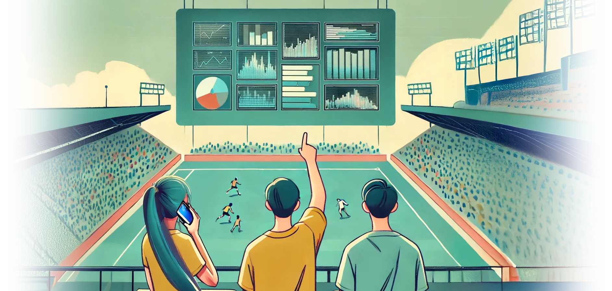

# YUS: Your Ultimate Stats

## Overview

Multiple stat lovers provide running play-by-play commentary on a game of Ultimate;
detailed statistics are derived including team, player, and time-based breakdowns.

## Objectives

* ~Natural language: commentators need not memorize or adhere to strict structure.
* Collaborative: multiple commentators can focus on different parts of the same game.
* Timestamps: all extracted events include time-from-start-of-game.
* Streamed processing: no post-game uploads of large files.
* Accurate names: speech-to-text pre-informed of players to improve accuracy.
* (later) Live stats: see stats develop during the game.

## Approach

### Illustrative Examples

#### Game play vs. Subs

| Commentator #1                                  | Commentator #2                                         |
| ----------------------------------------------- | ------------------------------------------------------ |
| Tristan has the disc.                           | White team starts with Tristan, Joe, Emily, Matt,      |
|                                                 | Drew. Dark team starts with James, Christian, Will,    |
|                                                 | Abby, Parm.                                            |
| Pull!                                           | Tristan Pulls.                                         |
| Parm catches the pull.                          |                                                        |
| Flick to Christian.                             |                                                        |
| Scoob. James catches.                           |                                                        |
| Backhand. Glass. Tristan Ds it.                 |                                                        |
| Tristan picks up for white.                     |                                                        |
| Tristan hammer. Joe scores.                     |                                                        |
| James picks up.                                 |                                                        |
| Backhand huck.                                  | Christian subs off. Angel subs on.                     |
| Off the net. Angel gets it.                     |                                                        |
| Backhand to Parm for a score.                   | Emily subs off. Matt off. Ari and Ben sub on.          |
| ...                                             | ...                                                    |

#### One-to-a-Team

| Commentator #1                                  | Commentator #2                                         |
| ----------------------------------------------- | ------------------------------------------------------ |
| I’m watching white, starting with Tristan,      | I’m watching black shirts. James, Christian,           |
| Joe, Emily, Matt, and Drew. Tristan to pull.    | Will, Abby, Parm on the field to receive.              |
|                                                 |                                                        |
| Tristan pulls!                                  | Go!                                                    |
|                                                 | Parm receives, flicks to Christian.                    |
|                                                 | Christian scoober to James.                            |
|                                                 | Backhand to Will bounces off the glass; turnover.      |
| Tristan knocks it down, picks it up.            |                                                        |
| Hammer huck to Joe in the end zone for a score. | Christian scored on.                                   |
|                                                 | Christian subbing off. James picks up. Angel comes on. |
|                                                 | James puts it deep; bounces off the net.               |
|                                                 | Angel catches.                                         |
| Nobody covering Angel.                          | Short put to Parm in the end zone.                     |
| Drew outpaced by Parm.                          | Emily and Matt subbing off.                            |
|                                                 | Ari on. Ben on.                                        |
| ...                                             | ...                                                    |

#### Commentator per player

…we don’t get a view of the overall game, but anyone who wants to know how often they make certain throws,
or how long they’re on the field, or how much game time they get, or what their completion percentage is,
can get someone to narrate just their performance.

Commentator: _“I’m only watching Tristan. Pull. D. Picks up. Hammer — scores. Subs off. …”_

#### Sole Commentator?

…pretty hard to get both subbing and offense covered when they overlap
(though that’s what happens with per team narration when they subbing on offense).

#### Commentator per player on field?

…hard to get 10 people to cover a full game, also when multiple sub off and on at the same time it's possible
or likely that there will be confusion, causing two people to cover the same player and no one to cover the other.

## Open Questions/Issues

* What if commentator doesn’t know the name of all 11 people on a team, or 22 people on both teams?
  * This is my biggest concern for indoor league. Maybe they just say “someone”?

* What if commentator makes a verbal mistake?
  * What are the sorts of things they would make a mistake on, what would they generally say in response?
    * Wrong name: “Joe catches it; flicks to…sorry, that wasn’t Joe, that was Connor to James”
    * Wrong throw type: “dump to Killian; a flick dump”
    * Wrong event “for a score…er, nope, not in, no score”
  * Fast pace of game makes it hard to make a correction in realtime.

* How to we fix inconsistent player references?
  * “Federbusch D's the disc. Picked up by Busch for white.”
  * “Blue tank top picks it up … flicked to blue tank … blue top goes deep.”
  * “Stephen Butler has the disc … D'd by Stephen … Butler has catches.”
  * “Killian takes the pull … huck to Killer in the end zone”

* What if _N_ commentators provide conflicting data? (Different player names, different accounts of what happened.)

## More Details

* [Architecture](docs/architecture.md) - get a little more technical with the vision.
* [Contributing](docs/CONTRIBUTING.md) - learn how you (yes, you!) can help.
