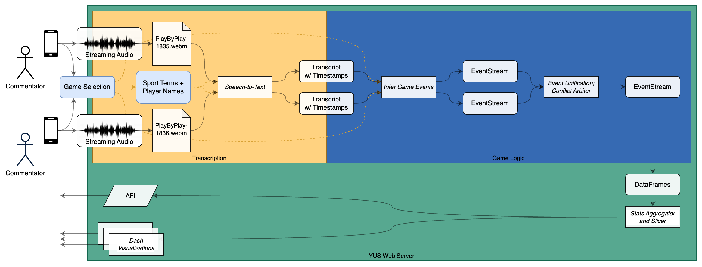

# Architecture of YUS

## Data Overview by Phases

1. `Terms` (by sport)
   * Words and phrases likely to be said by commentators.
2. `Game`
   * The sport being played, time of the game, names and colors of the teams playing.
   * The names, nicknames (possibly including jersey number) for the players on each team.
3. Play-by-Play
   * The term for a single monoaural audio stream, ideally uncompressed.
   * Initially recorded to a file and processed later; eventually streaming.
4. `Transcript`
   * Each `PlayByPlay` is converted into a `Transcript`.
     * _The mechanism for this—Google Speech-to-Text? Whisper? Otter.ai? Deepgram? Fathom? Krisp?_
       _Our own custom-trained ASR models per sport?—is open for debate and investigation._
   * One or more groupings of words — groupings provide breaks between definitely-unrelated utterances
   * Each "word" has a timestamp and one or more possible text interpretations.
     Each interpretation optionally is associated with a confidence score.
5. `EventStream`
   * Each `Transcript` is converted into a sequence of `Event` data structures.
   * The actual data structures will vary by sport, with different subtypes of events.
     For indoor Ultimate, the data structures and their attributes are:
       * `Event` (base class): timestamp, duration, player 'name', player's team.
       * `Throw`: throw type (e.g. `flick`), throw direction (e.g. `dump`), receiver 'name',
         outcome (e.g. caught, dropped, turfed), did it hit the wall, or netting, was it a score.
       * `Defense`: whether it was caught by player (or just prevented the catch).
       * `Substitution`: subbing off or on to the field
       * `Infraction`: TBD
6. _Event Unification_
   * One or more event streams for a single game are merged into a single event stream, performing:
     * Player normalization: align players described by the commentator with actual players in the game.
     * Event merging: detect when two events in different streams describe the same action on the field,
       merging and resolving conflicts between them.
7. `DataFrame`(s)
   * The unified event stream is converted into one or more `panda.DataFrame`s.
8. `Dash` components
   * Visualization will primarily be via web interface with custom [Dash](https://dash.plotly.com/)
     applications composing bespoke visualization components. YUS will provide convenience methods
     for producing attractive results based on filtering, grouping, and aggregating event data.
     (AKA "pivot tables", but not exposed to users as an editable pivot table, nor even
     necessarily showing certain results as a table at all.)
